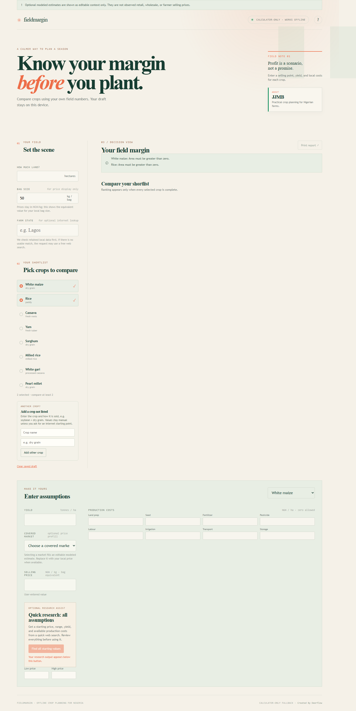
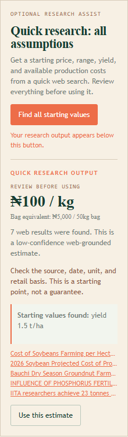
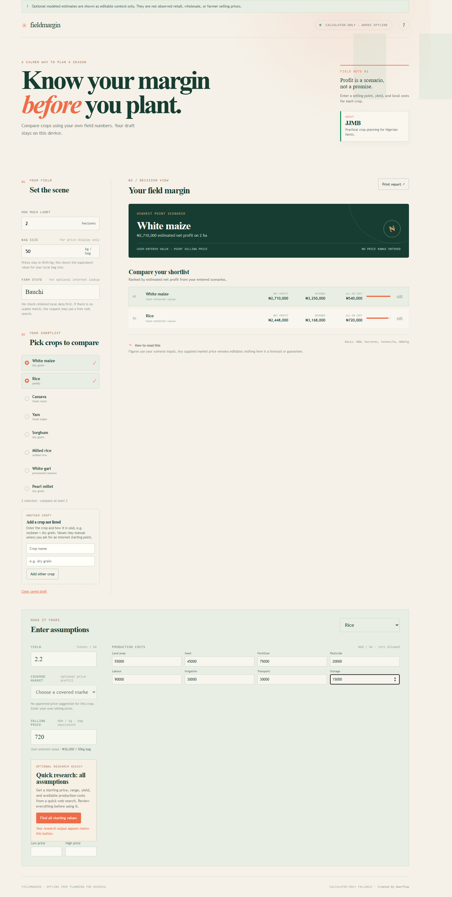
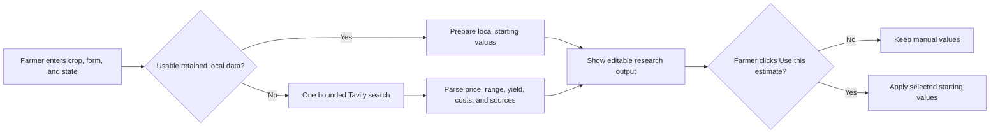

# fieldmargin

> A calmer way to plan a season.

Fieldmargin is an offline-first crop comparison tool for Nigerian farmers. It
helps you test a season using your own land, yield, selling price, and cost
assumptions before you plant.

<p align="center">
  <a href="https://crop-value-predictor.pages.dev/"><strong>Open the live app</strong></a>
  &nbsp; | &nbsp;
  <a href="./SESSION_HANDOFF.md">Read the project handoff</a>
  &nbsp; | &nbsp;
  <a href="./docs/deployment-runbook.md">Deployment runbook</a>
</p>

<p align="center">
  
  
  
  
</p>

<p align="center">
  
</p>

## Live demo

**[Launch the Fieldmargin demo](https://crop-value-predictor.pages.dev/)**

The production demo includes the offline calculator, custom crops, bag
equivalents, and optional Quick Research through the server-side Tavily route.

`https://crop-value-predictor.pages.dev/`

## Why it exists

Farm decisions often begin with incomplete information. Fieldmargin makes the
assumptions visible, lets you change them, and shows the effect on your margin.
The calculator stays useful without an internet connection, while an optional
research button can find a starting point when you want outside context.

## What you can do

| | Capability | What it means in practice |
| --- | --- | --- |
| **01** | Compare crops | Enter one field and compare a shortlist using the same calculation rules. |
| **02** | Add any crop | Add a crop name and product form, such as `Soybean` + `dry grain` or `Carrot` + `fresh`. |
| **03** | Research assumptions | Ask for a price, range, yield, and available cost categories for a Nigerian state. |
| **04** | Think in local units | See price in NGN/kg and the equivalent value for your bag size. |
| **05** | Keep control | Review every returned value and choose **Use this estimate** before it changes your scenario. |
| **06** | Work privately | Drafts stay in the browser on the device; the calculator itself works offline. |

## See it in action

### A complete research result

The research output appears directly below the button that requested it. It
shows the estimate, range, yield, available costs, warning, and evidence links.

<p align="center">
  
</p>

### The public release

The live release includes the field-notebook interface, Nigeria watermark, JJMB
about card, custom crop form, and calculator-only default.

<p align="center">
  
</p>

## How Quick Research works

Quick Research is an optional assistant, not an automatic price feed.



The public route is a Cloudflare Pages Function at
`/api/price-research`. The Tavily credential is stored as an encrypted
server-side secret and never shipped to the browser. The request is bounded and
the response is labelled low-confidence. A missing, malformed, or unsupported
answer fails safely back to manual entry.

## Try a custom crop

1. Open the [live app](https://crop-value-predictor.pages.dev/).
2. Enter your land area and a Nigerian state, for example `Bauchi`.
3. Under **Another crop**, enter a crop name and its product form.
4. Add it to the shortlist and complete the crop assumptions.
5. Click **Find all starting values** to see the research package below the
   button.
6. Check the source, unit, date, and warning. Click **Use this estimate** only
   when the values are suitable as your starting assumptions.

For example, the deployed flow was tested with `Soybean` / `dry grain` in
`Bauchi` and returned a low-confidence `NGN 110/kg` midpoint from an
`NGN 100-120/kg` range, `2.5 t/ha`, and eight source links.

## Run locally

### Requirements

- Node.js with npm
- Python 3 for the local research helper and validation suite

Install dependencies and start the development server:

```powershell
npm.cmd install
npm.cmd run dev
```

Open the local URL printed by Vite. The offline calculator works without a
Tavily key. For local Quick Research, provide `TAVILY_API_KEY` only to the
server process or use the documented external credential path; never commit a
key, put it in browser code, or paste it into a repository file.

## Validate a change

Run the smallest relevant checks while developing, then the full suite before
release:

```powershell
npm.cmd test
npm.cmd run typecheck
npm.cmd run build
npm.cmd run test:e2e
python -m unittest discover -s tests -v
```

The current release has passed the calculation tests, TypeScript check, Vite
build, browser tests, Python validation suite, and a public Playwright smoke
test against the production research route.

## Project map

The main code is organized into `src/` for the React calculator,
`functions/` for the hosted research endpoint, `pipeline/` for local data
helpers, `public/data/` for versioned context artifacts, and `docs/` for phase
contracts, deployment notes, and screenshots.

## Product boundaries

- The calculator is offline-first and manual-input-first.
- Research suggestions are editable context, not observed prices or forecasts.
- Online values never automatically rank crops or become default assumptions.
- The hosted route does not publish a price snapshot or reopen Stage 1.
- Stage 1 remains **Closed - fallback accepted**, with observed-price approval
  unresolved.
- Automated data integration and forecasting remain separately gated.

These boundaries are intentional: a quick web answer can be stale, use the
wrong unit, or describe a different market. The farmer remains the final
decision-maker.

## Documentation

- [Next-session handoff](./SESSION_HANDOFF.md)
- [Project progress](./PROJECT_PROGRESS.md)
- [Next actions and gates](./docs/next-actions.md)
- [Offline calculator phase](./docs/phases/02-offline-calculator.md)
- [Online research-assist phase](./docs/phases/03-online-research-assist.md)
- [Deployment runbook](./docs/deployment-runbook.md)
- [Custom crop and Nigeria visual proposal](./docs/proposals/crop-expansion-and-nigeria-map.md)

## About

Fieldmargin is the JJMB crop-planning project: practical planning support for
Nigerian farms, with clear assumptions and a gentler path from uncertainty to a
decision.
