# Prototype Batch-Training Architecture

**Decision date:** 2026-08-25  
**Status:** Approved for implementation as the prototype release design

## Purpose

The prototype trains once from the complete qualified historical window
available at launch. It does not perform online learning, local training, or
live prediction requests after deployment.

## Runtime boundary

```mermaid
flowchart LR
    S[Approved public sources] --> G[GitHub Actions launch workflow]
    G --> K[Kaggle CPU training job]
    K --> O[Metrics, model card, checkpoint, forecasts]
    O --> V[GitHub cloud validation and review]
    V --> P[Approved static JSON release]
    P --> H[GitHub Pages]
    H --> W[React PWA]
    W --> C[Cache Storage / IndexedDB]
    C --> D[Offline margin calculation]
```

GitHub Actions is the workflow authority. Kaggle is the remote training
backend. The Kaggle CLI is used only to submit a job, poll its status, and
retrieve outputs. Kaggle credentials stay in GitHub encrypted secrets and are
never shipped to the browser.

## Launch training contract

The manual workflow accepts:

- `release_id`: immutable identifier for the candidate release;
- `cutoff_month`: the latest complete month included in training;
- `source_config_sha`: the exact source and mapping configuration used.

The training job must record the input data checksums, source retrieval times,
cutoff, code commit, dependency lock, random seed, model parameters, and
rolling-origin validation results. Features dated after a validation origin or
the launch cutoff are rejected.

The job evaluates seasonal-naive, lagged ridge, and a CPU tree-based candidate.
The candidate is promoted only when it improves the agreed median MAE and WAPE
criteria. Otherwise the seasonal baseline is published with `model_status:
baseline`.

## Published versus retained outputs

The PWA receives versioned `catalog.json`, `defaults.json`, `forecasts.json`,
`quality.json`, and `manifest.json`. The trained checkpoint, backtest rows,
metrics, model card, and logs remain release artifacts for audit and
reproduction; the browser does not need model weights.

The launch snapshot is intentionally frozen. Once its validity window ends,
the PWA remains usable and displays a stale warning. A later release requires a
deliberate manual workflow run and review; there is no automatic retraining.

## Resource policy

Use CPU by default. The Nigerian monthly series and the selected candidate
models do not justify GPU allocation for this prototype. Colab is a manual
fallback only and is not part of the unattended release path.
