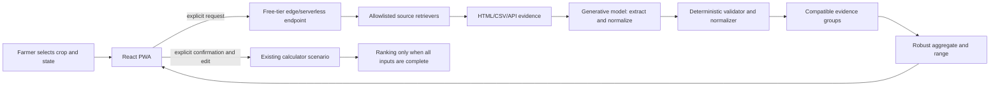

# Phase 3A — Optional Online Internet Aggregate Estimate

**Status:** Gate A authorized; bounded hosted deployment operational.
The local development slice and hosted Pages Function adapter are implemented
and verified. The calculator-only static site and optional hosted research route
are deployed. Formal source allowlisting, rights, privacy, and rate-limit
hardening remain follow-up work; hosted retrieval does not become an observed-
price feed.

**Gate A authorization date:** 2026-09-13

**Depends on:** Approved Stage 2 offline calculator; separate authorization for
this phase

**Does not change:** Stage 1 remains **Closed — fallback accepted** with
`stage_1_approved: false`. Stages 3 and 4 remain blocked.

## 1. Plain-language purpose

The current product is an offline calculator. A farmer enters expected yield,
selling price, and costs, and the calculator compares complete scenarios.

This proposed phase adds an optional button that can look for recent,
published Nigerian price evidence when the farmer has internet access. The
goal is not to prove that one official source is correct. The goal is to
produce the best defensible internet-informed aggregate estimate available at
the time of the request:

1. The farmer chooses a crop and Nigerian state.
2. A bounded online service searches approved sources.
3. The service collects comparable observations or listings, filters obvious
   problems, and calculates an aggregate estimate with a range.
4. The farmer reviews the estimate, its evidence, and its warnings, then
   confirms or edits it.
5. Only then can the value become part of a complete calculator scenario.

The target is a response within approximately three minutes. Three minutes is
a timeout target, not a promise that a current, accurate, or locally
representative price will be found.

## 2. Current product boundary

The approved product remains a browser-first, calculator-only PWA:

- The offline calculator remains the default and must work without the online
  service.
- Only complete farmer-entered scenarios may drive a ranking or recommendation.
- The existing World Bank modeled artifact remains separately labelled context.
  It is not an observed price, forecast, or automatic recommendation input.
- The failed FEWS API/static-export procedures are closed and must not be
  repeated merely to implement this feature.
- This phase does not create a reviewed static price snapshot, reopen Stage 1,
  approve an observed source, or unlock the automated pipeline.

An explicit farmer confirmation makes a web result an input to that farmer's
scenario; it does not make the source an approved production data source. The
value remains editable and its evidence remains visible.

## 3. Product decisions already made

| Decision | Requirement |
|---|---|
| Product mode | Optional hybrid mode; offline remains the default |
| Minimum search input | Nigerian state and crop/form |
| Source scope | Multiple Nigeria-focused, reviewed and rights-compatible sources; no single provider is required |
| Search authority | Candidate evidence requires farmer confirmation before use |
| Free retrieval | Tavily Search basic/fast search, server-side only, with a hard monthly quota stop |
| Model role | Search planning, extraction, normalization, and explanation only |
| Weak evidence | Show the best available candidate with an explicit warning; never present it as verified |
| Model-only number | Keep separate as context; do not automatically insert or rank it |
| Runtime | Small server-side or edge endpoint; keys never ship to the browser |
| Cost | Free-tier/zero-cost target; Tavily Search plus Workers AI, with a hard quota stop |
| Time bound | Approximately 180 seconds, including bounded retries |
| Storage | No cloud history for farmer scenarios; retain only minimum sanitized operational logs |
| Estimate target | Best available compatible aggregate, normally a recency- and geography-weighted median or trimmed mean |

## 3.1 Gate A review result so far

Gate A was authorized by the user on 2026-09-13. The review has established a
credible design direction but has not yet passed the gate:

| Area | Preliminary result | Remaining condition |
|---|---|---|
| Source strategy | Multi-source aggregation is the selected posture | Confirm each source's access, attribution, terms, fields, freshness, and permitted processing before allowlisting it |
| Hugging Face candidate | Useful development/profiling input; not a current source by itself | Compare coverage and transformations, record the Electric Sheep Africa repackage, and verify the underlying rights chain |
| FEWS NET | Deferred | Do not use it until its source-specific usage requirements and access path are separately cleared |
| World Bank modeled lane | Excluded from observed-price research | Keep it as labelled modeled context only |
| Edge runtime | Technically plausible on Cloudflare Workers/Pages Functions | Confirm account, request, subrequest, timeout, and free-plan behavior in the actual deployment account |
| Model runtime | Cloudflare Workers AI is the selected default direction | Select an eligible free model and confirm its current quota, availability, and data-handling terms |
| Web search provider | Tavily Search is the selected free retrieval direction | Confirm the account's free credits, rate limits, terms, and server-side secret handling |
| Google Search grounding | Excluded from the zero-cost design | Do not depend on Gemini Search grounding or a paid Google Cloud project |
| Privacy/secrets | Design is compatible with server-side secrets and no farmer-history storage | Complete the concrete logging, retention, and abuse-control review |

### User-provided access evidence — 2026-09-13

The user opened the WFP/HDX dataset page and received the message:

> The humanitarian website that you requested is not available for scraping.

This is a direct access-policy signal. Phase 3A must not scrape the dataset
webpage, bypass the restriction, rotate user agents to evade it, or repeatedly
retry the blocked page. The webpage is not an acceptable retrieval target.

The previous immutable Stage 1 audit contains a separate official resource
download that succeeded on 2026-09-10:

- resource: `Nigeria - Food Prices`;
- direct resource URL:
  `https://data.humdata.org/dataset/42db041f-7aaf-4ab4-961f-2a12096861e7/resource/12b51155-0cd3-4806-9924-61ede4077591/download/wfp_food_prices_nga.csv`;
- recorded license identifier: `cc-by-igo`;
- recorded last-modified time: `2026-09-06T16:46:09.690118`;
- retained artifact checksum:
  `10bfee3dbd4c1798ec4ea57b9611b025ddb3391147c238ab048185a24eb88d62`;
- profile: 88,556 rows through 2026-07-15.

The URL and metadata are evidence that a direct resource path existed; they do
not prove that the resource is current, that the link will remain stable, or
that the general HDX license guidance alone clears all intended use. Gate A
may treat WFP/HDX as a **provisional direct-resource candidate**, subject to
checking the exact resource metadata and terms again before implementation.
The app must link to the source and show the data date; it must not describe
the July 2026 artifact as live or current on 2026-09-13.

The Hugging Face candidate is a static snapshot, not an on-command live feed.
Its page currently shows 58.9k total rows, a latest observation of 2026-04-15,
and processing on 2026-04-06. It exposes useful fields such as crop,
location, market, unit, retail/wholesale basis, price flags, and source. The
page identifies Electric Sheep Africa as the engineer and records HDX/WFP
source context, while also stating that original source rights remain with the
original provider. It is therefore suitable for a development baseline or one
input into the aggregate, but it cannot by itself satisfy a current-price
request and must not be described as an official live WFP feed. See the
[Hugging Face dataset](https://huggingface.co/datasets/electricsheepafrica/africa-wfp-food-prices-for-nigeria).

### Raw WFP baseline QA — read-only verification, 2026-09-13

The retained raw WFP/HDX CSV was checked directly for use as one input to the
internet aggregate. The checks did not alter the file or the public app.

| Check | Result | Decision impact |
|---|---|---|
| Row count and schema | 88,556 rows and 16 expected fields | Pass |
| Missing values | Zero missing values in the checked fields | Pass |
| Exact duplicates | Zero duplicate rows | Pass |
| Observation-key duplicates | Zero duplicates for date, market, commodity, unit, flag, and price basis | Pass |
| Currency and numeric price | 88,556 NGN rows; all prices finite and positive | Pass |
| Geography | 14 states, 68 markets, and 43 commodities; geography fields and coordinates present | Pass, with uneven coverage |
| Time coverage | 2002-01-15 through 2026-07-15 | Usable snapshot, not live |
| Recent coverage | 3,559 rows in 2026, from Borno and Yobe only; the latest date has 28 rows from Borno | Requires a freshness warning and fallback rule |
| Geographic balance | Borno and Yobe provide about 68% of all rows | Do not weight raw rows as if they were independent national samples |
| Unit comparability | 75,660 rows use mass units; 12,896 use litres, pieces, units, or tubers | Convert explicit mass units; exclude or handle other units by crop-specific rules |
| Price flags | 1,217 rows use the combined `actual,aggregate` flag | Normalize and display this ambiguity; do not silently call it actual |

**Verification verdict:** the raw file passes structural QA and is suitable as
a baseline input for a bounded aggregate estimate. It does not pass as a
standalone current nationwide estimate. The estimate must use explicit
comparability, recency, and geographic-balance rules, and must show its date
and limitations.

To close this data-verification stage for the user's stated purpose, only the
following decisions and evidence are still needed:

1. Define the headline estimate as a compatible retail or wholesale aggregate,
   rather than mixing price bases.
2. Normalize explicit mass units to `NGN/kg`; exclude litres, pieces, units,
   and tubers unless a documented crop-specific conversion exists.
3. Use a recency window and fallback rule. The recommended default is the
   latest usable window, with a visible stale warning when the latest evidence
   is old or limited to a small number of states.
4. Balance geography so Borno/Yobe do not dominate simply because they have
   more rows. A state- or market-balanced median is preferable to a raw-row
   average.
5. Produce one reproducible aggregate report showing contributors, exclusions,
   dates, range, and warnings. Hugging Face must not be counted as an
   independent source when it contains the same WFP/HDX lineage.

These are definition and aggregation decisions, not a reason to search for a
larger copy of the same dataset. They can be completed without reopening the
failed FEWS path.

Tavily currently documents a free plan with 1,000 API credits per month and no
credit card requirement. Basic, fast, and ultra-fast searches cost one credit
each, so the service should use one search call first and allow at most one
bounded retry for a fallback request. See the [Tavily pricing
page](https://www.tavily.com/pricing) and [search API
documentation](https://docs.tavily.com/documentation/api-reference/endpoint/search).

Cloudflare currently documents Pages Functions as covered by Workers pricing,
with a Free plan allowance of 100,000 requests per day and no charge for
request duration, while the limits page documents 10 ms CPU time, 50
subrequests, and six simultaneous outgoing connections per request. Waiting on
network requests does not count as CPU time. These limits support a small,
bounded lookup but do not guarantee that every request will finish within the
three-minute target. See the [Workers pricing](https://developers.cloudflare.com/workers/platform/pricing/)
and [Workers limits](https://developers.cloudflare.com/workers/platform/limits/)
documentation.

Workers AI currently documents a 10,000-neuron daily free allocation, with
some models requiring paid billing and model availability subject to change.
The service must therefore pin an eligible model at implementation time and
disable the feature if the free allocation or model access is unavailable. See
[Workers AI pricing](https://developers.cloudflare.com/workers-ai/platform/pricing/)
and the [Workers AI model catalog](https://developers.cloudflare.com/workers-ai/models/).

HDX's general guidance says CC BY-IGO material may be shared or adapted with
attribution, a license link, and no implied endorsement. That guidance is not
itself approval for the specific WFP Nigeria resource; the resource metadata
and any WFP terms must be checked before the source is added to the Phase 3A
allowlist. See [HDX data licensing guidance](https://centre.humdata.org/ufaqs/data-licenses/)
and [HDX sharing guidance](https://centre.humdata.org/ufaqs/sharing-data/).

## 4. User experience

### 4.1 Request flow

The online action is available only as an explicit opt-in. The interface must
show that it uses the internet and may return incomplete or stale evidence.

The request requires:

- one supported crop form;
- one Nigerian state; and
- the existing scenario context where available, without transmitting costs or
  personal information unless a later privacy review explicitly authorizes it.

The service may discover several markets or price bases. It must not silently
combine retail, wholesale, farm-gate, listing, and model-estimate values into a
single number. It first groups evidence by compatible crop form, unit, price
basis, geography, and time window. The review screen keeps each source and
group visible and explains which evidence contributed to the aggregate.

### 4.2 Review flow

The aggregate review shows, at minimum:

- estimated value and unit, normalized to `NGN/kg` only when the conversion is explicit;
- an uncertainty range and an evidence/confidence label;
- the number of contributing observations and their date span;
- the aggregation method and any weighting or exclusions;
- crop and product form;
- state and market coverage;
- the compatible retail, wholesale, farm-gate, or listing basis;
- retrieval timestamp;
- a visible list of publisher names and direct source URLs;
- source-level values, dates, and warnings used to form the aggregate.

The farmer must choose **Use this estimate** or enter a different value. The
chosen value stays editable. The action must be distinct from silently filling
a default. If only one weak observation is available, the interface must say
that it is a single-source estimate rather than presenting it as a strong
average.

After confirmation, the calculator still requires every other required field.
An incomplete crop or incomplete shortlist cannot rank.

### 4.3 Beginner-facing wording

Use plain language such as:

> We found this price on the internet. Check the source, date, unit, and price
> type before using it. This is a starting point, not a guarantee.

Do not use “official,” “verified,” “live,” “best price,” or “forecast” unless
the displayed evidence and the relevant gate actually support that claim.

## 5. Proposed architecture

The static PWA does not scrape arbitrary websites directly. It calls one
controlled endpoint only after the farmer requests a lookup.



### 5.1 Browser responsibilities

The browser may:

- collect the crop and state request;
- show progress, timeout, partial, and failure states;
- render candidate evidence;
- let the farmer confirm or edit a value;
- retain the confirmed value in the existing local draft;
- calculate only from the resulting complete scenario.

The browser must not:

- contain search or model credentials;
- scrape third-party pages directly;
- treat a model response as a source;
- bypass robots controls, access restrictions, paywalls, or bot protection;
- make a background request or silently refresh a price.

### 5.2 Service responsibilities

The endpoint must:

- validate a small request schema and reject unsupported crops or locations;
- use only configured, reviewed, rights-compatible sources;
- enforce per-source timeouts, bounded retries, response-size limits, and a
  total request deadline;
- preserve the source URL and retrieval metadata;
- use the model only to extract fields from retrieved evidence or resolve a
  documented ambiguity;
- run deterministic checks after model output;
- return structured candidates or a structured failure;
- avoid storing farmer scenarios, costs, names, phone numbers, or free-form
  personal data;
- emit sanitized operational metrics sufficient to identify failures and quota
  exhaustion.

### 5.3 Local implementation now available

The first implementation slice is intentionally local and development-only:

- `pipeline/online_estimate.py` reads the retained raw WFP/HDX CSV, filters by
  exact crop form, state, retail/wholesale basis, and recent date window, then
  converts mass units to NGN/kg and balances the estimate across markets.
- If no compatible local rows exist, the helper makes one bounded Tavily
  request using a credential loaded from `TAVILY_API_KEY` or the external file
  `%USERPROFILE%\\.config\\crop-value-predictor\\tavily-key.txt`.
- `vite.config.ts` exposes `POST /api/price-research` only while running the
  local Vite development server. It validates crop, state, and price type,
  invokes the helper with argument arrays, caps the request body, and applies a
  110-second process deadline. The key never enters browser JavaScript or the
  command line.
- `src/main.tsx` requests research only after the user clicks the button. It
  shows the returned value, range, coverage, warning, and sources, then waits
  for **Use this estimate** before changing the scenario. Confirmed provenance
  is retained in the local draft; manual edits change the label back to a
  user-entered value.

Run locally with `npm.cmd run dev`, open the displayed local URL, enter a
Nigerian state, and use **Find internet estimate**. The retained raw artifact
must exist for the local-first branch. A missing artifact, unavailable provider,
timeout, or malformed answer leaves the calculator in manual-entry mode.

### 5.4 Hosted deployment adapter

The production-shaped adapter is deployed at
`functions/api/price-research.ts`. It accepts the same small request, including
validated custom crop name/form fields, keeps the Tavily secret in the Pages
Function environment, limits the request to one bounded Tavily call, parses
explicit and natural-language price/yield/cost markers, and returns a
low-confidence result with source URLs or a fail-closed error. `wrangler.toml`
sets the Pages output directory to `dist/`.

The production deployment is live at
`https://crop-value-predictor.pages.dev/`. Its encrypted `TAVILY_API_KEY`
secret is server-side only. It does not publish the retained WFP snapshot or
reopen Stage 1. The deployment checklist and stop conditions are in
[`docs/deployment-runbook.md`](../deployment-runbook.md).

The local Vite slice is not the production endpoint: it does not provide rate
limiting, an approved hosted source allowlist, Workers AI model extraction, or
shared caching. Those remain Gate B/D hardening work. The hosted Function is
deployed, but it remains bounded and must not be expanded without review.

The Cloudflare Pages deployment is the selected edge/serverless context. The
owner explicitly authorized production deployment after acknowledging possible
Tavily usage charges. Free-tier limits, terms, source rights, privacy, and
rate-limit hardening still require review before expanding this lane.

## 6. Proposed interface contracts

These are future interfaces for the implementation gate. They are documented
now but do not exist in the current application.

### 6.1 Request

```ts
type PriceResearchRequest = {
  cropId: string
  state: string
  requestedAt: string // timezone-aware ISO 8601 timestamp
}
```

The request must not include a secret, full scenario history, or unnecessary
personal information. A future implementation may add a narrowly scoped
language or market hint only after a new privacy review.

### 6.2 Response

```ts
type PriceResearchResponse = {
  requestId: string
  status: 'complete' | 'partial' | 'timeout' | 'failed'
  retrievedAt: string
  aggregate?: PriceResearchAggregate
  candidates: PriceResearchCandidate[]
  warnings: string[]
  errorCode?:
    | 'INVALID_REQUEST'
    | 'NO_ALLOWLIST_SOURCE'
    | 'NO_USABLE_EVIDENCE'
    | 'UPSTREAM_TIMEOUT'
    | 'QUOTA_EXHAUSTED'
    | 'SERVICE_UNAVAILABLE'
}

type PriceResearchAggregate = {
  valueNgnPerKg: number
  lowNgnPerKg?: number
  highNgnPerKg?: number
  method: 'weighted_median' | 'trimmed_mean' | 'single_observation'
  basis: 'retail' | 'wholesale' | 'farm_gate' | 'listing'
  contributingCandidateIds: string[]
  observationCount: number
  dateFrom?: string
  dateTo?: string
  confidence: 'low' | 'medium' | 'high'
  warnings: string[]
}

type PriceResearchCandidate = {
  candidateId: string
  cropId: string
  state: string
  marketName?: string
  valueNgnPerKg: number
  originalValue?: number
  originalUnit?: string
  priceBasis: 'retail' | 'wholesale' | 'farm_gate' | 'listing' | 'model_estimate'
  evidenceKind: 'published_observation' | 'published_listing' | 'model_context'
  observationDate?: string
  publicationDate?: string
  source: {
    publisher: string
    title: string
    url: string
    sourceId: string
  }
  evidenceNote: string
  status: 'usable_with_warning' | 'insufficient_for_confirmation'
  warnings: string[]
}
```

The service must not return a bare number. An aggregate without source,
location, basis, unit, and date is either rejected or marked
`insufficient_for_confirmation` and cannot be offered as a calculator value.

## 7. Retrieval and model policy

### 7.1 Source allowlist

Before implementation, each source needs a small register containing:

- publisher and canonical URL;
- allowed access method;
- terms, robots, and redistribution decision;
- expected fields and units;
- geography and market coverage;
- freshness behavior;
- failure and fallback behavior.

Initial sources should prioritize accessible structured datasets, established
Nigerian agricultural and market publications, and reputable public listings.
The Hugging Face WFP/HDX repackage may be included as a dated snapshot after
its provenance and rights chain are recorded. A search engine result may help
discover a page, but the page itself must be retained as the evidence source.
Tavily is only the discovery/retrieval service; it is not itself the publisher
of a price observation and must not be cited as the price source.

Do not use arbitrary public-web scraping as the first release. Do not bypass
technical controls. Do not copy a source's complete protected database into a
new public artifact.

### 7.2 Model boundary

The generative model may:

- turn the farmer's crop/state request into allowlisted search queries;
- identify a price field in a retrieved page or document;
- normalize a clearly documented unit conversion;
- summarize differences between candidates;
- explain why evidence is weak or conflicting.

The model may not:

- invent a price when no source states one;
- fill missing dates, units, markets, or price bases by guessing;
- claim that an unverified source is official;
- silently merge incompatible prices;
- replace deterministic validation;
- turn a model-only estimate into a verified observed price.

If the only available number is a model estimate, show it separately as
`model_context` with a strong warning. It is not automatically eligible for
confirmation or ranking.

The initial free model direction is Cloudflare Workers AI. The model receives
Tavily results and, where permitted, bounded page content; it does not receive
an unrestricted browser session. A model call is optional after local data
lookup and must stop when the free allocation or request deadline is reached.

### 7.3 Aggregate calculation and selection

The service must calculate the estimate only from compatible evidence. The
default method is a weighted median because it is less distorted by one very
high or low value. A trimmed mean may be used when there are enough comparable
observations. Weights may reflect:

- recency;
- geographic match to the requested state or market;
- directness of the published value;
- retail/wholesale or other requested basis;
- source completeness and evidence quality.

The service must show the method, contributors, exclusions, date span, and
range. “Best available” means the best aggregate under these declared rules,
not a guaranteed best local price. It must not average incompatible units,
price bases, crop forms, currencies, or time periods merely to obtain a
number. With one usable observation, it must return a clearly labelled
single-observation estimate. With no usable observations, it must return no
estimate.

Conflicting candidates remain separate. The service must not calculate a
national median, forecast, or recommendation from this response.

## 8. Validation rules

Every returned candidate is checked deterministically for:

- supported crop and product form;
- Nigerian state and any published market;
- positive finite numeric value;
- explicit currency and unit;
- safe conversion to `NGN/kg`, with the conversion recorded;
- recognizable price basis;
- observation/publication date when the source provides one;
- no future date;
- source URL on the allowlist or an explicitly reviewed discovered page;
- evidence text or structured field that actually contains the value;
- duplicate and conflicting candidate handling;
- aggregate method, contributing records, exclusions, and range calculation;
- freshness warning rather than silent freshness assumptions.

The validator rejects malformed, unsupported, future-dated, unitless, or
source-less candidates. It warns on stale, indirect, listing-based,
state-mismatched, or incomplete evidence.

The existing calculator validation remains authoritative after confirmation:
area, yield, selling price, every cost, and any range must be complete and
valid before ranking.

## 9. Timeouts and failure behavior

The service uses a total approximately 180-second deadline with shorter
per-source and model deadlines. It returns whatever has passed validation at
the deadline with `status: 'partial'` or `status: 'timeout'`.

| Situation | Required behavior |
|---|---|
| No network | Offline calculator remains usable; show that online lookup is unavailable |
| One source fails | Continue only within the bounded source plan; label missing coverage |
| All sources fail | Return `failed` with no candidate and preserve manual input |
| Time limit reached | Return validated partial candidates, or no candidate if none passed |
| Quota exhausted | Return a clear quota message and manual-input fallback |
| Conflicting prices | Show separate candidates and explain the different basis/date/source |
| Only model estimate exists | Show separate context only; never silently insert it |
| Invalid model output | Discard it and retain source evidence or return no candidate |
| Stale evidence | Show it as stale; require explicit user review and confirmation |

The “best available” aggregate never overrides the confirmation requirement.

## 10. Privacy, secrets, and abuse controls

- Keep all model/search credentials in the edge service environment, outside
  the repository and browser bundle.
- Reject credential paths inside the repository if local development uses a
  credential file.
- Do not log secrets, source cookies, full request headers, or farmer-entered
  costs.
- Apply per-IP and per-device rate limits suitable for a free tier.
- Limit request size, source count, response size, redirects, and model tokens.
- Use a circuit breaker when a source repeatedly fails.
- Cache only short-lived, rights-compatible research responses if caching is
  later approved; never cache private farmer scenarios in shared storage.
- Provide a clear notice that external sources may be stale, incorrect, or
  unavailable.
- Review source terms, model terms, retention, and cross-border processing
  before deployment.

Free-tier operation is a constraint, not a reliability guarantee. If a free
provider changes its quota or terms, disable the online button safely rather
than exposing keys, adding paid usage, or weakening validation.

## 11. Implementation gates and ordered work

Gate A is authorized for review, and the user has separately authorized the
local development slice. Hosted implementation and deployment remain subject
to the unresolved Gate A evidence and a separate deployment decision. Work
proceeds in this order:

### Gate A — Product, aggregation, and rights design

- create a Phase 3A-specific multi-source register without changing the
  historical Stage 1 register;
- verify each selected source's metadata, license, attribution, access method,
  processing rights, freshness, and caching/redistribution limits;
- record the Hugging Face dataset as a third-party, dated repackage unless its
  underlying rights and transformations are explicitly cleared;
- approve the deterministic normalization, compatibility grouping, weighting,
  aggregate, range, and minimum-evidence rules;
- keep FEWS deferred until its source-specific usage requirements and access
  path are cleared;
- record the Cloudflare Worker/Pages Function and Workers AI account limits,
  eligible model, quota, timeout behavior, and data-handling terms;
- approve user wording, evidence labels, privacy, retention, rate limits, and
  secret handling;
- document an explicit Gate A decision with evidence and unresolved risks.

**Stop if:** a source has unclear rights, a provider requires paid access,
or the design cannot keep secrets server-side.

**Gate A evidence required:** a source/rights record, provider/free-tier record,
privacy and secret-handling record, candidate contract review, and a written
user gate decision. Documentation alone records the proposal; it does not pass
the gate.

**Current Gate A disposition:** the product target is now a multi-source
internet aggregate. The Hugging Face dataset is a promising static input but
is not current by itself and is not yet cleared as a production source. Gate A
remains open until the initial source set, provenance/rights, aggregation rules,
Tavily and Workers AI free-tier behavior, privacy controls, and bounded
retrieval behavior are documented and approved.
The blocked webpage must not be used as a scraping target.

### Gate B — Service contract and deterministic validation

- The local reference implementation is at `pipeline/online_estimate.py`. It
  reads the retained raw CSV, balances local market estimates, rejects unsafe
  credential paths, and calls Tavily only for a missing-location fallback.
- The Vite development server now exposes a bounded, same-origin
  `/api/price-research` route in `vite.config.ts`. It validates the request and
  invokes the Python helper without putting the Tavily key in browser code or
  command arguments. This is a local development route, not a hosted service.
- implement the request/response schemas;
- implement allowlisted retrieval and bounded timeouts;
- implement deterministic unit/date/basis/source validation;
- add model extraction behind a replaceable adapter;
- make failure and partial results explicit.

**Stop if:** a model-only number can pass as an observed price, a malformed
candidate reaches the UI, or the endpoint cannot fail closed.

### Gate C — UI review and calculator handoff

- The UI has an explicit state input and lookup button; it does not make a
  background web request.
- Results are shown for review with the estimate, range, coverage, date/source
  information, warnings, and direct web links where available.
- Only **Use this estimate** transfers a result into the calculator. The value
  remains editable and its origin is saved with the local draft.
- Lookup failure leaves manual entry and the offline calculator intact.
- Existing complete-scenario ranking rules and offline operation remain in
  place.

**Stop if:** online results silently populate fields, alter ranking without
confirmation, or break offline calculation.

### Gate D — Evidence and deployment review

- run deterministic unit and contract tests;
- run browser tests with mocked service responses;
- test offline, timeout, partial, stale, conflict, quota, and malformed cases;
- review accessibility and beginner wording;
- review free-tier usage and source rights again;
- obtain separate deployment authorization.

**Stop if:** the test evidence is incomplete, costs are no longer zero/free
tier, or the service makes unsupported accuracy claims.

## 12. Acceptance criteria

Phase 3A is ready for a gate review only when:

1. The offline calculator still works with the endpoint unavailable or
   networking disabled.
2. A lookup is impossible without an explicit farmer action.
3. The service uses only reviewed sources and keeps credentials out of the
   browser and repository.
4. Every contributing observation contains source, URL, basis, unit, location,
   and date or an explicit missing-field warning; every aggregate identifies
   its method, contributors, range, and date span.
5. The model cannot invent or silently complete unsupported facts.
6. Invalid, stale, conflicting, partial, timed-out, and quota-exhausted cases
   have deterministic behavior.
7. No candidate affects ranking before explicit confirmation.
8. Confirmed estimates remain editable and their provenance is visible in the
   scenario/report.
9. The approximately three-minute deadline is enforced and observable.
10. Free-tier limits, source rights, privacy, and retention are documented.
11. No online result is promoted into `public/data`, the Stage 1 snapshot, the
    automated pipeline, or forecasting artifacts.
12. A separate user decision approves or rejects the Phase 3A gate.

## 13. Explicit non-goals

- No automatic live-price default.
- No automatic ranking from web or model output.
- No claim that the result is a forecast, guarantee, or official market price.
- No reopening of the failed FEWS path for convenience.
- No arbitrary scraping, paywall bypass, bot-protection bypass, or terms
  violation.
- No paid API, paid model, always-on backend, account system, or cloud storage
  requirement.
- No background refresh or collection of farmer scenarios.
- No Stage 3 automated snapshot or Stage 4 forecasting work.

## 14. Beginner summary

The calculator can stay useful without the internet. The proposed button is
like asking a research assistant to look through a small list of trusted
websites. The assistant may find a number, but it can misunderstand a unit,
use an old advert, or find a wholesale price when the farmer needs a farm-gate
price. That is why the app shows the evidence and asks the farmer to check and
confirm it.

The generative model is a reading helper, not a measuring instrument. It can
help locate and explain information, but it cannot make an unsupported number
trustworthy. The project therefore keeps the current calculator and its Stage
1/Stage 3 safeguards intact until a later, separate review approves the online
lane.

## 15. Current status record

As of 2026-09-13:

- Gate A is authorized; the bounded hosted lane is deployed under explicit
  owner authorization, while broader hardening remains open;
- multi-source aggregation is the selected product posture;
- Tavily Search is the selected free web-retrieval provider direction;
- the Hugging Face WFP/HDX repackage is a candidate snapshot for investigation,
  not a current or official live feed;
- Cloudflare Pages Functions is the deployed server-side context; Workers AI is
  not enabled;
- local development and public production browser endpoints exist at
  `/api/price-research`;
- a bounded live Tavily retrieval test and public endpoint smoke test have run;
  the public route returns low-confidence research context only;
- `pipeline/online_estimate.py` and the Vite route are local development
  components only;
- no model has been pinned or quota-verified for production use;
- no Phase 3A source allowlist or rights register has been approved for this
  feature;
- the calculator-only static site is deployed at
  `https://crop-value-predictor.pages.dev/`;
- the hosted Function is active at `https://crop-value-predictor.pages.dev/`
  with `TAVILY_API_KEY` held as an encrypted production secret;
- no public snapshot has changed;
- Stage 1 remains closed with fallback accepted and unapproved;
- Stage 2 remains approved for complete farmer-entered offline scenarios.

The local implementation and hosted adapter are verified. Public online
retrieval is enabled only through an explicit user action and returns editable,
low-confidence context. Nothing is promoted into `public/data` or the Stage 1
snapshot; privacy/rate-limit hardening and any source expansion remain open.
